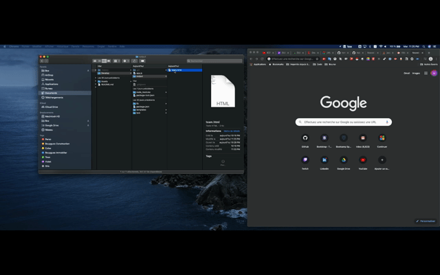

# Template Engine CLI
The aim of this project, was to create a tool to quickly create a team, using command lines.
# Table of content
- [Installation](#installation)
- [Usage](#usage)
- [Licence](#licence)
- [Contributing](#contributing)
- [Questions](#questions)

# Installation
    npm install

# Usage
- Make sure that you have node installed
- Then you can clone this repo to your computer, and run npm install to get the modules needed to run this app.
- After, you only need to type "node app.js" to answer the prompt.

- You will get a "team.html" file in the output folder.

# Licence
No licence
# Credits
Not credits
    
# Questions
- Hedi Calabrese
- Github : hedical

## Main Language used in this repo              
